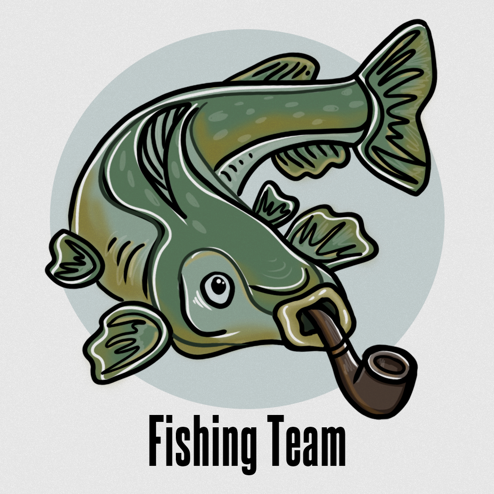

# Контроль и управление изменениями в тендерных закупках
## Описание проекта

Инструмент на базе ИИ для выявления аномальных паттернов в финансовом поведении.

# Метрики качества решения
## Описание метрик

1. Метрика Центр-Инвеста: ```74%```
2. 
# Инструкция по работе с проектом
## Создание виртуальной среды и работа с ноутбуками

Для подготовки окружения для работы с модулями и ноутбуками выполните следующие команды, находясь в корневой директории проекта:

```bash
# команды создания виртуального окружения
python3 -m venv .venv

# активация виртуального окружения
## Windows
.venv\Scripts\activate

## macOS & Linux
source .venv/bin/activate

# установка необходимых библиотек в виртуальное окружение
pip install -r requirements.txt
```

## Режим разработки

Режим разработки ведется в следующих Jupyter Notebook'ах:
- `main_solution.ipynb`
- `isolation_forest_solution.ipynb`
   - Представление текстовых табличных данных типа csv в виде датасета, хранящийся в `data\dataset.csv`
  
# Структура проекта

```bash
atom-compliance-ml
├─ .gitignore
├─ data                          # Данные для обучения и тестирования, а также сама метрика
│  ├─ dataset.csv
│  ├─ metric.txt
│  ├─ preds.csv
│  ├─ processed_data.csv           # Весь фронтенд проекта  
├─ frontend
│  ├─ assets
│  │  ├─ logo.png
│  ├─ css
│  │  ├─ link_card.css
│  │  ├─ profile.css
│  │  ├─ styles.css
│  │  ├─ styles_login.css
│  │  ├─ success_styles.css
│  │  ├─ transfers.css
│  ├─ html
│  │  ├─ index.html
│  │  ├─ link_card.html
│  │  ├─ login.html
│  │  ├─ profile.html
│  │  ├─ register.html
│  │  ├─ transfers.html
│  ├─ js
│  │  ├─ link_card.js
│  │  ├─ login.js
│  │  ├─ logout.js
│  │  ├─ profile.js
│  │  ├─ register.js
│  │  ├─ transfers.js                     
├─ backend                       # Весь бекенд проекта
│  ├─ src
│  │  ├─ api
│  │  │  ├─ client.py
│  │  ├─ database
│  │  │  ├─ database.py
│  │  │  ├─ models.py
│  │  │  ├─ schemas.py
│  ├─ main.py                      
└─ model                     # Ноутбуки для обучения и экспериментов, модули, EDA анализ
   ├─ src   
   │  ├─ notebooks
   │  │  ├─ isolation_forest_solution.ipynb
   │  │  ├─ main_colution.ipynb
   │  ├─ scripts
   │  │  ├─ processing_dataset.py
   ├─ eda
   │  │  ├─ graphs
   │  │  │  ├─ corr_matrix.png
   │  │  │  ├─ dataset_stat.png
   │  │  │  ├─ location_statics.png
   │  │  │  ├─ spendings_day_of_week.png
   │  │  │  ├─ spendings_device_type
   │  │  ├─ notebooks
   │  │  │  ├─ graphs.ipynb                              

```

# Контакты
Если у вас есть вопросы или предложения по проекту, пожалуйста, свяжитесь с нами:
- Александр, DS, TL
   - @BeesKnights
- Анна, Frontend
   - @mbhopper
- Денис, Backend
   - @Denbay0
- Варвара, Designer
   - @shterenfeld




